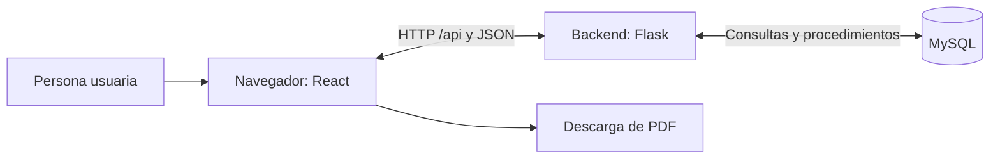

# Documentación técnica — Orden de Fabricación

Documento para el profesor, el cliente y quien mantenga la instalación. Describe la versión revisada del repositorio, incluidos el consumo ampliado de materiales, los detalles Composite/Forrado y el historial de actividad. La revisión es de código y documentación: no acredita una instalación, restauración ni prueba de carga en la PC del cliente.

Lecturas complementarias: [instalación del cliente](manual-instalacion-cliente.md), [manual de usuario](manual-usuario-cliente.md) y [guía de presentación](guia-presentacion.md).

## 1. Descripción general del sistema

Orden de Fabricación es una aplicación web para empresas o talleres que fabrican calzado y necesitan relacionar planificación, materiales y producción. Ayuda a reunir información que de otro modo quedaría repartida entre remitos, órdenes y planillas, para consultar qué se solicitó, qué se recibió y qué se produjo.

El circuito comprende recepción de materiales, producto, orden por talles, corte y aparado, recepción de cortes, calzado, puntera, inyección e inspección final. Permite seguir materiales vinculados a las planillas, consultar disponibilidades, generar PDFs y obtener estadísticas de producción.

Su alcance actual es la gestión de ese circuito. No se documentan como funciones implementadas la contabilidad, facturación, liquidación de sueldos ni una gestión integral de compras y costos.

## 2. Tecnologías utilizadas

| Parte | Tecnología y función |
| --- | --- |
| Interfaz o frontend | React, React Router y Vite. Presentan pantallas, formularios y navegación en el navegador. |
| Comunicación | Axios realiza solicitudes HTTP a la API; los datos se intercambian en JSON. |
| Servidor o backend | Python y Flask, con rutas agrupadas por módulo. Flask-CORS participa en la configuración de comunicación. |
| Persistencia | MySQL, mediante `mysql-connector-python`, consultas SQL y procedimientos almacenados. |
| Configuración local | `python-dotenv` carga las variables de conexión y la instalación aporta la clave de sesión. |
| Presentación | CSS con variables compartidas, por ejemplo `--bg-card`, `--text-main` y `--border`. El modo noche usa `:root[data-theme="noche"]`; la preferencia de tema se conserva en el navegador. |
| PDFs | jsPDF y jsPDF-AutoTable generan documentos en el frontend. Hay salidas desde Órdenes y Trazabilidad. |
| Pruebas | Vitest, React Testing Library y jsdom en frontend; pytest en backend. |
| Docker | Empaquetado previsto. No se encontraron Dockerfiles, archivos Compose ni `frontend/nginx.conf` en esta rama: **pendiente de verificar según empaquetado final**. |

Las dependencias están declaradas en [package.json](../frontend/package.json), [package-lock.json](../frontend/package-lock.json), [requirements.txt](../backend/requirements.txt) y [requirements-test.txt](../backend/requirements-test.txt). El manual de instalación indica cómo preparar el entorno; no se presupone compatibilidad con cualquier versión de Python, Node o MySQL.

## 3. Arquitectura general



El frontend valida formularios y muestra resultados. El backend comprueba sesión, permisos y reglas de carga, y accede a MySQL. La base conserva los registros y sus relaciones. El navegador no se conecta directamente a MySQL.

En desarrollo, Vite normalmente sirve el frontend en `http://127.0.0.1:5173` y redirige `/api` al backend en `http://127.0.0.1:5000`. Este proxy se configura en [vite.config.js](../frontend/vite.config.js). La entrega para una red o servidor necesita su propia configuración de publicación; las direcciones de desarrollo no definen por sí solas un despliegue de producción.

### Organización del proyecto

| Carpeta o archivo | Responsabilidad |
| --- | --- |
| `frontend/src/App.jsx` | Comprobación de sesión y rutas de las pantallas. El login se muestra cuando no hay sesión; no requiere una ruta `/login` independiente. |
| `frontend/src/pages/` | Pantallas de los módulos. |
| `frontend/src/components/` | Componentes compartidos de formularios, consultas y mensajes. |
| `frontend/src/hooks/` y `frontend/src/utils/` | Paginación, avisos de cambios sin guardar, permisos, cálculos de estadísticas y generación de PDF, entre otras utilidades. |
| `backend/app.py` | Registro de rutas, comprobación de sesión y participación del registro de actividad. |
| `backend/routes/` y `backend/controllers/` | Direcciones de la API y operaciones de cada módulo. |
| `backend/db/` | Conexión y ajustes de esquema. |
| `backend/utils/` | Ayudas de acceso a datos, permisos, autoría e historial, entre otras. |
| `docs/modelo_base_datos/` | Modelo, instalación SQL, procedimientos y ajustes históricos. |

Componentes relevantes: `Toast` muestra confirmaciones y errores; `ConfirmModal` pide confirmar acciones; `RetryMessage` permite reintentar cargas; `ClearableSearch` limpia búsquedas con una X; `Pagination` y `usePagination` organizan listados. `SelectorMaterial` filtra materiales, `CatalogModal` facilita altas de catálogos y `PermisoRegistro` controla acciones visibles. `AutoriaRegistro` muestra la actividad reciente y permite consultar su historial cuando corresponde. `obtenerMensajeError` transforma errores en mensajes comprensibles. Estas funciones se usan en las pantallas que las incorporan, no necesariamente en todas.

### Rutas principales

La API usa rutas REST por recursos: `GET` para consultar y `POST`, `PUT` o `DELETE` para las operaciones que cada ruta implemente. Esta tabla es orientativa; no implica que todas admitan todos los métodos.

| Pantalla o función | Ruta del frontend | API principal |
| --- | --- | --- |
| Sesión y cuentas | Login sin sesión; `/usuarios` | `/api/auth/login`, `/api/auth/me`, `/api/auth/logout`, `/api/auth/recuperar`, `/api/auth/usuarios` |
| Inicio | `/` | `/api/dashboard/resumen` y consultas de los módulos |
| Productos y catálogos | `/productos` | `/api/productos/`, `/api/catalogos`, `/api/colores/` |
| Materiales y proveedores | `/materiales`, `/proveedores` | `/api/materiales/`, `/api/proveedores/` |
| Recepción de materiales | `/recepcion-materiales` | `/api/remitos/`, `/api/lotes/` |
| Órdenes | `/ordenes` | `/api/ordenes/`, `/api/ordenes/<id>/talles` |
| Recepción de cortes | `/recepcion-cortes` | `/api/recepcion-cortes/` |
| Planillas | `/planillas` | `/api/planillas/`, subrutas de detalles y operarios |
| Producción diaria | `/produccion-diaria` | `/api/produccion-diaria/`, `/api/produccion-diaria/disponibilidad`, `/api/maquinas/` |
| Uso de materiales | `/uso-materiales` | `/api/uso-materiales/` |
| Trazabilidad | `/trazabilidad` | Consulta órdenes y planillas; la API también ofrece `/api/trazabilidad/orden/<id>/materiales` y consultas por lote. |
| Estadísticas | `/estadisticas` | Consulta `/api/produccion-diaria/` y `/api/ordenes/`; el resumen se calcula en frontend. |
| Historial de actividad | Acción **Ver historial** en registros habilitados | `/api/historial/<recurso>/<id>`; acceso de administrador o maestro. |

Los parámetros `<id>` y `<recurso>` representan identificadores, no texto para copiar literalmente. Las definiciones exactas están en [App.jsx](../frontend/src/App.jsx), [app.py](../backend/app.py) y [routes](../backend/routes/).

## 4. Módulos del sistema

| Módulo | Qué permite y qué aporta al circuito |
| --- | --- |
| Login, sesión y roles | Ingresar con una cuenta activa, consultar sesión y cerrar sesión. Hay recuperación con código para la cuenta maestra. |
| Dashboard | Resumen de registros, alertas y avance general. Facilita acceder a información ya cargada. |
| Productos | Relacionar modelo y color fijo, y definir el consumo de cuero por par propuesto al crear una orden. |
| Materiales | Mantener el catálogo de nombres de materiales; no equivale por sí solo a una recepción de stock. |
| Proveedores | Mantener nombre y datos de contacto/identificación de quien entrega materiales. |
| Recepción de materiales | Registrar remitos, proveedor y líneas de materiales por lote, cantidades y observaciones. En cuero permite consultar saldo y cerrar/reabrir lotes. |
| Órdenes R013 | Planificar cantidades por talle, fechas, responsables, Composite/Forrado y materiales. Al guardar se vincula la R013 de corte y aparado y se registran consumos. |
| Recepción de cortes R018/1 | Registrar tandas por orden y remito, controlador, pares recibidos y conformidad. Comprueba cantidades acumuladas. |
| Planillas R013/1 | Registrar calzado, puntera, inyección e inspección final; relaciona talles, operarios, inyectora y materiales. |
| Producción diaria | Cargar una jornada con bloques por inyectora y líneas por orden. Actualiza la producción vinculada a las R013/1. |
| Uso de materiales | Consultar y registrar cantidades utilizadas de un lote en una planilla. Debe evitarse duplicar usos generados por otros módulos. |
| Trazabilidad | Consultar relaciones entre orden, planillas, producción, operarios y materiales/remitos. |
| Estadísticas | Resumir producción por período, fecha, inyectora, producto/color e inspección; distinguir cantidades producidas de cantidades de órdenes. |
| Usuarios | Gestionar cuentas y contraseñas según rol. La interfaz maestra permite cambiar rol y estado de cuentas no maestras. |
| PDFs | Descargar la orden desde Órdenes y el detalle desde Trazabilidad, según la información registrada. No hay una exportación universal de cada pantalla. |

El historial de actividad complementa estos módulos. En los registros habilitados muestra acciones, usuario y fecha; incluye medidas para evitar duplicados en su consulta. No ofrece una reconstrucción completa de todos los campos antes y después de cada cambio.

## 5. Flujo principal de trabajo

1. Preparar los catálogos y proveedores necesarios; recibir materiales con su remito y lotes.
2. Crear o revisar el producto, su modelo, color y consumo por par.
3. Crear la orden con número, fechas y **total de pares distribuido entre talles**. Revisar responsables y detalles Composite/Forrado.
4. Seleccionar cuero/materiales y revisar consumo y disponibilidad por lote. Guardar genera los usos de su R013.
5. Registrar la recepción de cortes en una o varias tandas R018/1, con su control de conformidad.
6. Preparar o consultar la planilla R013/1 asociada a la orden.
7. Cargar producción desde Planillas o Producción diaria. Son caminos relacionados: no registrar los mismos pares en ambos.
8. Consultar los usos ya generados y cargar manualmente solo lo que corresponda y no esté registrado.
9. Revisar el resultado en Trazabilidad, abrir los PDFs y consultar Estadísticas para el período correcto.

Este es el recorrido operativo recomendado, no una afirmación de que el sistema bloquee todas las etapas si falta una anterior. Una demostración completa requiere catálogos, lotes, órdenes y producción preparados en una base de prueba; no se presupone que el repositorio cargue todos esos datos automáticamente.

## 6. Stock y consumo de cuero/materiales

| Concepto | Significado actual |
| --- | --- |
| Recibido | Cantidad asentada en el lote al recibir el material. |
| Utilizado | Suma de usos registrados para ese lote, incluidos los creados desde Órdenes. |
| Descartado | Remanente registrado como no utilizable al cerrar un lote. |
| Disponible | En un lote abierto: `máximo(recibido − utilizado − descartado, 0)`. Un lote cerrado tiene disponibilidad cero. |
| Consumo por par | Unidades de material previstas para un par; el producto propone un valor, que se puede ajustar en la orden. |

Ejemplo demo, con una misma unidad de medida: recibir **10**, crear una orden de **20 pares totales** y usar **0.25 por par**. Se registran **5 utilizadas** y quedan **5 disponibles**; recibido sigue siendo 10. El consumo por lote se redondea a dos decimales al guardar.

El descuento se registra al guardar la orden, antes de la fabricación física. Hoy combina consumo/reserva y no distingue formalmente ambos conceptos. Con varios lotes, cada uno calcula sobre el total de pares y su consumo por par; no hay reparto automático entre lotes.

Si el consumo supera lo disponible, Órdenes muestra **Stock de material insuficiente**, con disponible, requerido y faltante. **Cancelar** conserva el estado anterior; **Guardar igualmente** registra el consumo completo. Con 5 disponibles y 6 requeridas, queda disponibilidad visible 0: no se incorpora material ni se resuelve el faltante físico. Esa excepción debe acordarse con el responsable; no existe un circuito de aprobación separado documentado.

Al editar una orden se excluyen sus usos previos de R013 para calcular el saldo y luego se reemplazan. Los usos manuales en esa misma planilla requieren revisión. Los caminos de uso manual no tienen necesariamente las mismas validaciones de stock de Órdenes.

**Alcance ampliado de esta versión:** Órdenes reconoce nombres que contienen cuero, cromo, doble frontura, vaqueta, floter o piqué, sin distinguir mayúsculas ni acentos. El selector inicial prioriza esos materiales y permite buscar otros; no todos los materiales seleccionables tienen consumo automático por par. La identificación depende del nombre, por lo que renombrar materiales usados puede afectar el comportamiento.

En Recepción de materiales, el panel específico de disponibilidad y los botones de cierre/reapertura siguen mostrándose para nombres que contienen «cuero». Cerrar registra el remanente como descarte; reabrir quita el cierre, borra el motivo y pone el descarte en cero, sin recuperar físicamente material.

Consultar [flujo de stock de cuero](flujo-stock-cuero.md) para los ejemplos y precauciones. Esa guía y la de presentación conservan el texto anterior «Stock de cuero insuficiente»; en esta versión el aviso es general para materiales. El historial de actividad actual tampoco equivale a un libro completo de movimientos de stock.

## 7. Base de datos y respaldo

MySQL conserva tablas relacionadas mediante identificadores y claves foráneas. Entre las principales están `producto`, `orden_fabricacion`, `detalle_orden`, `remitos`, `lote_materiales`, `planilla_produccion`, `detalle_planilla`, `operarios_planilla` y `uso_materiales`. Otros grupos cubren producción diaria, recepción de cortes, cuentas y registro de actividad.

Los procedimientos almacenados ejecutan parte de las altas, consultas y modificaciones. El esquema inicial y los procedimientos están en [modelo_base_datos](modelo_base_datos/). Hay ajustes históricos SQL y un script [migrate_db.py](../backend/migrate_db.py) que utiliza [migrations.py](../backend/db/migrations.py).

**No ejecutar el SQL de instalación sobre una base con datos:** `bd_orden_fabricacion.sql` contiene `DROP DATABASE IF EXISTS orden_fabricacion`. Tampoco corresponde importar todos los SQL por rutina.

El arranque de Flask llama a `configurar_admin()`, y algunos controladores aseguran tablas o columnas al atender solicitudes. `migrate_db.py` no se ejecuta automáticamente desde `app.py`. La actualización debe revisar el estado previo, hacer backup y aplicar solo los ajustes que correspondan, incluso antes de abrir pantallas con una versión nueva.

El respaldo debe incluir datos y procedimientos de la versión utilizada. Un archivo mayor que 0 bytes es necesario pero no suficiente: comprobar errores y una restauración en un entorno separado. No subir copias ni credenciales al repositorio. El [manual de instalación](manual-instalacion-cliente.md) contiene el procedimiento de backup y restauración.

## 8. Seguridad y usuarios

El backend utiliza sesiones de Flask y exige sesión en las rutas protegidas. El ingreso compara usuario respetando mayúsculas, verifica que la cuenta esté activa y comprueba su contraseña. Las contraseñas se guardan como **hashes mediante Werkzeug**, no en texto plano ni como un cifrado reversible para recuperar la clave original. Los códigos de recuperación también se verifican mediante hash.

| Rol | Alcance general actual |
| --- | --- |
| Maestro | Gestión de cuentas de administradores y empleados; recuperación de cuenta maestra; consulta de actividad. |
| Administrador | Gestión de empleados y de su propia cuenta dentro de sus permisos; consulta de actividad. |
| Empleado | Operación y edición de registros, incluidos ajenos o antiguos según los permisos actuales; sin gestión de usuarios ni consulta del historial de actividad. |

La eliminación de registros se reserva en la API a administrador/maestro; las cuentas tienen restricciones adicionales. No describir al empleado como «solo lectura» ni afirmar que solo puede editar durante cierto tiempo. Los roles operativos actuales son amplios; permisos más finos son una mejora futura.

Las cuentas iniciales ya documentadas incluyen `Admin` / `Admin1234` de rol Maestro. La lista está en el [manual de instalación](manual-instalacion-cliente.md). Son credenciales demo/iniciales: **cambiarlas para uso real**. Reiniciar no restablece contraseñas modificadas.

La instalación debe aportar una `FLASK_SECRET_KEY` propia y proteger `backend/.env`. El arranque `python app.py` usa Flask en desarrollo con depuración: el despliegue real debe definir servidor, red y protección de acceso. HTTPS, publicación y gestión de secretos de la entrega Docker: **pendiente de verificar según empaquetado final**.

La recuperación por código está implementada para una cuenta maestra activa. El acceso local sin código que menciona el login depende de un script de entrega ausente en esta rama; no se presenta como una herramienta ya disponible.

## 9. Pruebas y compilación

Desde `frontend/`, con las dependencias instaladas:

```bash
npm test
npm run build
```

`npm run test:watch` mantiene las pruebas ejecutándose al guardar. `npm run dev` inicia la interfaz para revisar el comportamiento en navegador. Hay pruebas de sesión, selectores, fechas, permisos, producción, órdenes y consumo, entre otras; su existencia no certifica toda combinación de datos.

Comprobación dirigida de Órdenes y permisos:

```bash
npx vitest run src/pages/Ordenes.test.jsx src/components/PermisoRegistro.test.jsx
```

Para backend, desde `backend/` y con el entorno virtual activo:

```bash
python -m pip install -r requirements-test.txt
python -m pytest -v
```

**Configurar primero una base de pruebas aislada.** `backend/tests/conftest.py` importa `app`, que ejecuta `configurar_admin()` y puede escribir en la base incluso antes de las pruebas. No asumir que todos los tests están aislados por sus simulaciones.

Limitación identificada: `test_recuperacion_local.py` necesita `entrega-cliente/scripts/recuperar-admin.py`, ausente en esta rama. Debe resolverse esa dependencia para completar esa prueba. Una advertencia de bundle grande no equivale a un build fallido si el proceso termina correctamente.

Estos comandos documentan la verificación a realizar; no se ejecutaron pruebas de aplicación, build ni operaciones de base al redactar estos manuales.

## 10. Limitaciones conocidas y mejoras futuras

| Tema | Estado actual y trabajo pendiente |
| --- | --- |
| Docker final | Falta el paquete verificable de entrega: imágenes, servicios, puertos, variables, frontend/nginx, servidor backend, MySQL, volúmenes, actualización y recuperación. **Pendiente de verificar según empaquetado final**. |
| Auditoría/historial | Ya hay autoría, última actividad e historial de eventos con controles de duplicados. Ampliar cobertura, detalle de campos modificados y garantías de conservación; no presentarlo como auditoría completa e inmutable. |
| Stock más completo | Definir reserva frente a consumo real, desperdicios, ajustes, devoluciones y autorización de faltantes/reaperturas. Unificar el alcance de los controles entre caminos de carga. |
| Reportes/exportaciones | Ya existen PDFs y estadísticas. Otras salidas y reportes específicos deben acordarse; no prometer Excel ni exportación general no implementada. |
| Concurrencia | Existen transacciones y bloqueos en operaciones de stock y cantidades. Falta validar el circuito completo con varios usuarios y volumen real; no se ha certificado una capacidad simultánea. |
| Permisos más finos | Definir responsabilidades por operación y restricciones sobre stock, edición y autorizaciones según la empresa. |
| Operación del cliente | Confirmar unidad de medida, catálogos, cuentas, responsables de backup, recuperación local y ensayo de restauración antes de usar datos reales. |

La entrega se completa con capacitación y una prueba acordada sobre datos conocidos, siguiendo el [manual de usuario](manual-usuario-cliente.md) y la [guía de presentación](guia-presentacion.md).
